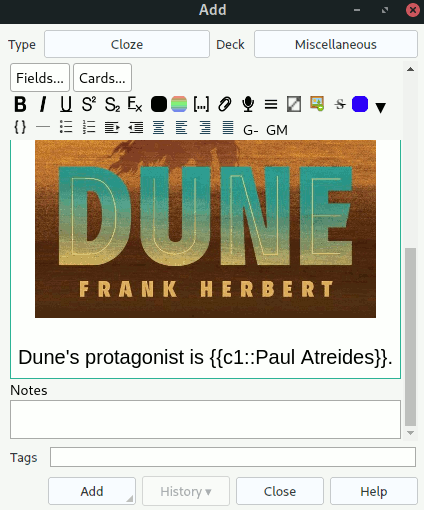

# Anki Image Scaler

An Anki plugin that scales images during editing. This plugin sets CSS
`max-height` property of all images in a note field to the desired value.

  

## Background

I spent a lot of time solving Anki cards, and I believe that Anki notes should
look good. I solve most of my cards on my phone that, as any phone, has a small
screen, so when I create a new card, I usually scale down added images, so that
the card will look good on my phone.

## Installation

1. Run `package`.
2. Import `imagescaler.ankiaddon` in Anki.

## For Developers

Use pipenv to set up the dev and prod environment.

### Testing

Run `testall` to run Mypy and unit tests.

### Publishing

The plugin is published and distributed on
[AnkiWeb](https://ankiweb.net/shared/info/1312865748).
